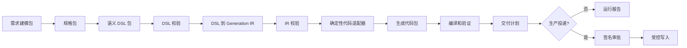

# code-production-pipeline 架构说明

## 1. 定位与边界

`code-production-pipeline` 位于目标项目根目录：`<项目工作区>/code-production-pipeline`。它是一个以 Python 实现的、由契约驱动的代码生产平台，不是某个具体业务模块。

它将需求、规格和领域 DSL 之后的处理固定为可校验、可复现的确定性流程：



AI 的责任边界截至 DSL：需求建模、规格和 DSL 可以由 AI 产出；DSL 进入管线后，转换、代码生成、验证与交付均不允许 AI 参与。管线通过 `ai_involvement: none`、SHA-256 哈希、追溯标识和阻塞门禁来执行这个约束。

## 2. 目录与组件

| 目录或文件 | 职责 |
| --- | --- |
| `pipeline-contract.yaml` | 定义六个阶段、各阶段产物、硬门禁、追溯链。 |
| `adapter-contract.yaml` | 规定适配器输入、输出、禁止行为和目标平台约束。 |
| `validators/` | 校验 DSL、IR、输入锁和生产目标模型。校验失败立即终止。 |
| `transformers/dsl_to_generation_ir.py` | 将已发布的语义 DSL 包确定性转换为 `generation-ir.yaml`。 |
| `adapters/` | 将 IR 适配为通用 Java 参考输出或 XCERP Java/MyBatis 输出，并验证结果。 |
| `delivery/` | 生成文件级交付计划、校验计划，以及在签名批准后执行受控投递。 |
| `scripts/pipeline_runner.py` | 命令行编排器，按受信工作区配置依次调用脚本并写运行报告。 |
| `runtime/` | 本地 HTTP 控制台、SQLite 作业队列、工作区注册表和配置锁。 |
| `fixtures/` | 参考工作区及非生产/生产目标模型模板。 |
| `runs/` | 每一次平台运行的 IR、生成结果、交付计划和运行报告。 |

## 3. 契约与数据流

### 3.1 阶段契约

`pipeline-contract.yaml` 定义以下六个阶段：

| 阶段 | 生产者 | 核心产物 | 输出契约 |
| --- | --- | --- | --- |
| `requirement-model` | AI | 阶段清单、原子需求、领域模型、规则目录、追溯 | 结构化需求包 |
| `specification` | AI | 领域规格、行为规格、验收规格、追溯 | 与实现无关的规格包 |
| `dsl` | AI | DSL 清单、领域/状态/规则 DSL、生成映射 | 已校验语义 DSL 包 |
| `generation-ir` | 确定性转换器 | IR、源哈希、生成单元、未决项门禁 | 可供生成器消费的 IR |
| `generation` | 确定性适配器 | 文件清单、生成结果、代码追溯、构建测试结果 | 生成代码包 |
| `delivery` | 确定性交付规划器 | 交付计划、文件差异、审批门禁、交付追溯 | 可审查的代码交付包 |

固定追溯链为：`REQ-* -> SPEC-* -> DSL-* -> GEN-* -> CODE-* -> TEST-*`。每个关键产物都使用 SHA-256 记录输入及输出版本。

### 3.2 语义 DSL 包

DSL 阶段提供一个目录包，至少包含 `dsl-manifest.yaml` 和以下声明的工件：

```text
dsl-manifest.yaml
domain.yaml
state-machine.yaml
rules.yaml
authorization.yaml
integration.yaml
generation-map.yaml
```

`dsl-manifest.yaml` 必须声明输入文件、输入哈希、工件路径、开放问题门禁及追溯要求。`generation-map.yaml` 为每个生成目标声明 DSL 元素、能力、规格追溯和 `blocked_by`。未决问题会使对应生成单元变为 `blocked`，而不是由生成器猜测实现。

### 3.3 Generation IR

`dsl_to_generation_ir.py` 读取 DSL 包后生成 `generation-ir.yaml`。它会：

1. 验证输入哈希与 DSL 清单一致。
2. 收集领域模型、状态机、规则、授权与集成信息。
3. 将每个生成目标标记为 `ready` 或 `blocked`，并保留阻塞原因。
4. 写入 DSL 工件哈希、上游哈希、开放门禁、生成范围和追溯信息。
5. 固定 `transform.ai_involvement` 为 `none`。

`validate_generation_ir.py` 会再次核对 IR 的版本、源文件哈希、上游哈希、门禁集合、生成单元状态及规格追溯。IR 不通过校验时，不会进入任何适配器。

## 4. 完整执行链

### 4.1 命令行编排器

入口为 `scripts/pipeline_runner.py`：

```text
python code-production-pipeline/scripts/pipeline_runner.py \
  --workspace <已注册的工作区配置> \
  --output <空的运行目录> \
  --execute
```

执行器的工作顺序如下：

1. 读取工作区 YAML，并通过 `runtime/workspaces.yaml` 和 `runtime/workspace-lock.yaml` 校验工作区 ID、配置路径与配置哈希，拒绝未注册或被篡改的配置。
2. 确认需求建模、规格、DSL 三个上游目录及其 manifest 存在；若声明了 `input_lock`，先执行 `verify_input_lock.py`。
3. 执行工作区配置中的 DSL 预校验。
4. 执行 DSL 到 IR 转换，并检查生成的 IR 和 AI 边界。
5. 执行 IR 后校验。
6. 只有带 `--execute` 时，才执行适配器、代码验证、交付计划和交付计划校验。
7. 在输出根目录写入 `pipeline-run-report.yaml`，记录每一步命令、返回码、截断后的标准输出/错误、输入哈希和最终状态。

执行器只允许调用 `ALLOWED_STEP_SCRIPTS` 中列出的平台脚本，要求使用当前 Python 解释器，并给每个步骤设置 120 秒超时。这避免工作区配置借机执行任意命令。

### 4.2 参考工作区配置

`fixtures/sales-contract-reference.pipeline.yaml` 是已注册的参考配置，定义了：

```text
DSL 校验
  -> DSL 到 IR
  -> IR 校验
  -> xcerp_java_mybatis_adapter
  -> verify_xcerp_java_mybatis_output
  -> prepare_delivery_plan
  -> verify_delivery_plan
```

这不是生产工作区。它使用非生产参考目标模型，交付模式为 `plan-only`，因此只生成代码和交付计划，不允许写入目标业务模块。

## 5. 代码适配器层

### 5.1 通用 Java 参考适配器

`adapters/generic_semantic_java_adapter.py` 面向通用、隔离的参考输出。它只消费已校验 IR 与目标模型，生成领域目录和契约测试，写入：

```text
generation-result.yaml
src/main/java/.../GeneratedDomainCatalog.java
src/test/java/.../GeneratedDomainCatalogContractTest.java
```

其验证器 `verify_generic_semantic_java_output.py` 检查结果清单、Java 文件、测试文件，并用 `javac`/`java` 编译和执行生成的契约测试。

### 5.2 XCERP Java/MyBatis 适配器

`adapters/xcerp_java_mybatis_adapter.py` 消费 IR 和明确的物理目标模型。它不会根据语义字段名猜测列名，目标模型必须显式给出聚合、类名、表名、属性、列名、Java 类型；生产目标还要提供 SQL 类型和空值约束。

已授权时，它可生成：

```text
domain/entity/*.java
domain/state/*.java
infra/mapper/*.java
infra/repository/*.java
src/main/resources/mapper/generated/*.xml
src/test/java/.../XcerpGenerationContractTest.java
src/main/resources/db/migration/*.sql  # 仅生产目标
generation-result.yaml
```

Controller、DTO、集成适配器和授权适配器等能力在契约未完整时会明确写入 `deferred`，不会伪造代码。

## 6. 验证与交付安全边界

### 6.1 生产目标门禁

`validate_production_target.py` 要求生产目标满足：

- `production_output: true` 与 `approved-for-production-output` 审批状态。
- `create-only` 覆盖策略，禁止覆盖已有文件。
- `controlled-apply` 交付模式，目标模块位于仓库内且含 `pom.xml`。
- 独立 Maven overlay 验证命令与合理的超时配置。
- 明确的迁移工具和 `src/main/resources/` 下的迁移路径。
- 每个字段都有物理列、Java 类型、SQL 类型和 nullable 配置。

### 6.2 交付计划与受控写入

`prepare_delivery_plan.py` 只比较生成文件和目标模块，输出每个文件的 `new`、`skip` 或 `conflict` 状态及哈希。计划阶段不写入业务模块。

生产写入必须再经过 `apply_delivery_plan.py`，并同时满足：

1. 交付计划为无冲突的 `controlled-apply`。
2. 用户显式传入 `--apply`；未传入时只能 dry-run。
3. 审批记录包含未过期的 HMAC-SHA256 签名。
4. `PIPELINE_DELIVERY_APPROVAL_KEY` 可用。
5. 计划、目标模型、生成结果、源文件和既有目标文件的哈希全部复核通过。

实际写入会留下交付 journal；v1 生产路径只允许创建新文件。

### 6.3 生产验证隔离

`verify_xcerp_maven_overlay.py` 将生成文件临时覆盖到外部准备的干净 worktree 中执行 Maven 验证，完成后移除覆盖文件。它不在原始工作区中直接覆盖文件。

## 7. 运行时控制台

`runtime/server.py` 提供仅本机绑定的 HTTP 服务，默认地址为 `127.0.0.1:4174`。主要接口为：

| 接口 | 行为 |
| --- | --- |
| `GET /api/workspaces` | 返回已注册工作区及生成单元状态。 |
| `GET /api/workspaces/{id}` | 返回单个工作区、开放门禁和可执行单元。 |
| `POST /api/runs` | 创建运行作业；必须选择全部且仅选择 `ready` 单元，禁止部分执行。 |
| `GET /api/runs` | 返回最近作业。 |
| `GET /api/runs/{id}` | 返回作业状态；成功后附带运行报告、生成结果与交付计划。 |

作业状态存放在 `runtime/state/pipeline-jobs.db`。`JobStore` 使用 SQLite 事务领取队列任务；进程重启时会将尚在运行的任务标记为 `interrupted`，避免把未知中断误报为成功。当前运行时是单 worker 顺序执行，单个作业超时为 900 秒，队列上限为 100。

## 8. 与 Eva `/coding` 的关系

Eva 没有通过 `pipeline_runner.py`、工作区注册表或运行时 API 启动完整平台。当前实现位于 `src/main/services/requirement-engineering-service.ts` 的 `buildCodingInternal()`，直接使用工作区内 `code-production-pipeline` 的一组脚本：

```text
domain-language.dsl
  -> Eva: parseDomainDsl() / writeSemanticDslPackage()
  -> validators/validate_semantic_dsl.py
  -> transformers/dsl_to_generation_ir.py
  -> validators/validate_generation_ir.py
  -> adapters/generic_semantic_java_adapter.py
  -> adapters/verify_generic_semantic_java_output.py
```

Eva 的 `/coding` 运行目录位于：

```text
<项目工作区>/.eva/RMSD/<需求名称>/coding/
  intermediate/runs/<DSL-SHA256>/
    00-input/
    01-semantic-dsl/
    02-generation-ir/
  output/runs/<DSL-SHA256>/
    codegen-manifest.json
    03-generated-code/
    04-verification/
```

因此，Eva 当前调用的是“非生产通用 Java 参考生成”子链路：它不会调用 XCERP MyBatis 适配器、Maven overlay 校验、交付计划或 `apply_delivery_plan.py`，也不会把代码写入业务模块。完整生产能力仍需通过平台的已注册工作区与受控交付流程使用。

## 9. 测试与扩展点

生产安全回归测试在 `code-production-pipeline/tests/test_production_guards.py`，覆盖生产目标字段约束、生产迁移生成、签名交付 dry-run 和作业中断恢复。

扩展新目标平台时，应新增独立适配器和目标模型契约，而不是修改通用转换器或在 DSL 中硬编码物理实现。适配器必须遵守 `adapter-contract.yaml`：仅消费已校验 IR、拒绝阻塞单元、拒绝 DSL 后 AI 参与、不推断物理字段、不越界写入、并为每个输出写入哈希与追溯信息。

## 10. 源码依据

本说明依据以下实际源码和契约文件整理：

- `<项目工作区>/code-production-pipeline/pipeline-contract.yaml`
- `<项目工作区>/code-production-pipeline/adapter-contract.yaml`
- `<项目工作区>/code-production-pipeline/scripts/pipeline_runner.py`
- `<项目工作区>/code-production-pipeline/runtime/server.py`
- `<项目工作区>/code-production-pipeline/runtime/job_store.py`
- `<项目工作区>/code-production-pipeline/validators/`
- `<项目工作区>/code-production-pipeline/transformers/dsl_to_generation_ir.py`
- `<项目工作区>/code-production-pipeline/adapters/`
- `<项目工作区>/code-production-pipeline/delivery/`
- `src/main/services/requirement-engineering-service.ts`
